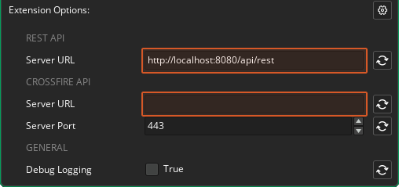

@title Getting Started

# Getting Started

## Setting Up Elements

See the [Elements docs](https://namazustudios.com/docs/getting-started/elements-in-five-minutes-or-less/).

1. Install Docker.
2. Run Docker Desktop (the Docker engine needs to be running).
3. Clone the repository at https://github.com/NamazuStudios/docker-compose.
4. Open a command prompt and switch to the directory where you cloned the repo.
5. Run the command `docker compose up`. This will set up and start the local Elements instance.
6. Open a web browser and enter `http://localhost:8080/admin/login`. If all went fine this should bring you to the admin dashboard login page.

If you are having issues with getting the local Elements instance up and running, see the [Common Issues with Docker](https://namazustudios.com/docs/troubleshooting/troubleshooting/community-edition/common-issues-with-docker/) page for more information.

## Setting Up the Extension

After setting up Elements locally, add the Elements extension to your project.



In the extension options, set the **Server URL** to the API Base URL:

> http://localhost:8080/api/rest

(See the [REST API Overview](https://namazustudios.com/rest/api/))

If you're also using the CrossFire API, also enter the **Server URL** under the **CROSSFIRE** section:

> http://localhost:8080/app/ws/crossfire/match

## Testing Locally

See the [Elements docs](https://namazustudios.com/docs/getting-started/accessing-the-web-ui-cms/) for info on how to access the web UI.

## How To: Use the Wrapper Functions

See: ${page.api_structure}

## Pagination and Search filters

Some endpoints allow you to specify the number of results to be returned (e.g., in case of a large number of results). In this case, you can make subsequent requests where each request returns a subset of the results, starting at a given offset and limited to a maximum number of results.

Some Elements endpoints also allow you to filter the returned results. The search filter is passed to these functions using a parameter `_search`.

Example:

```gml
elements_get_missions(0, 10, "name=mission1&duration=300", function(_status, _data, _request) {
    var _max_ten_results = (array_length(_data) <= 10);
    show_debug_message($"Max 10 items in result: {_max_ten_results}");
});
```